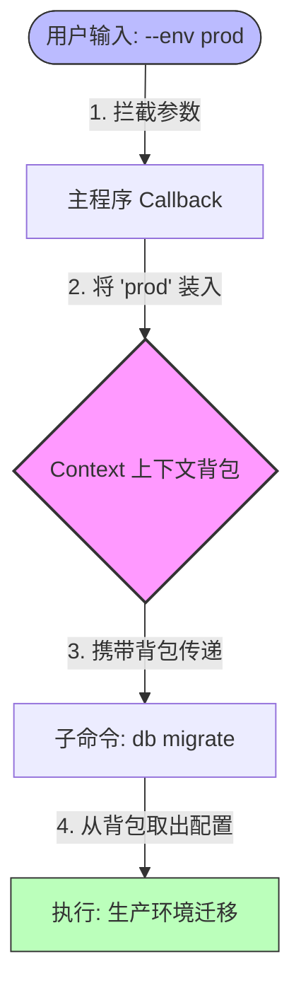

# 从脚本到工具：Python Typer 极简实战指南


> **写在前面**：
> 很多人写 Python 脚本只用来跑一次性任务，一旦功能复杂，代码就变得难以维护。本文档旨在通过一个轻量级的 **To-Do List** 案例，演示如何利用 [Typer](https://typer.tiangolo.com/) 库，将零散的脚本重构为**结构清晰、交互友好、可测试**的标准命令行工具 (CLI)。
> 
> *核心价值：参数规范、用户交互、错误处理、项目结构与基础测试。*

<a id="toc"></a>
## 目录 (Table of Contents)

1. [快速入门：Quick Start](#chapter-1)
2. [核心机制：Arguments 与 Options](#chapter-2)
3. [提升体验：DX 与交互体验](#chapter-3)
4. [健壮性：Robustness](#chapter-4)
5. [进阶架构：Context 与 Subcommands](#chapter-5)
6. [综合案例：构建 To-Do List 管理器](#chapter-6)
7. [测试与发布：工程化的最后一公里](#chapter-7)

---

<a id="chapter-1"></a>
## 1. 快速入门 (Quick Start)

Typer 的核心哲学是 **“代码即文档”**。利用 Python 3.6+ 的类型提示 (Type Hints)，我们无需编写复杂的参数解析逻辑。

### 1.1 环境准备
```bash
pip install "typer[all]"
```

### 1.2 Hello World (`hello.py`)
我们先写一个最简单的打招呼程序，包含两个子命令。

```python
import typer

app = typer.Typer()

@app.command()
def hello(name: str):
    """最简单的打招呼命令"""
    print(f"Hello {name}")

@app.command()
def goodbye(name: str, formal: bool = False):
    """
    道别命令。
    --formal: 这是一个可选的开关 (Flag)，用于切换正式语气。
    """
    if formal:
        print(f"Goodbye, Mr./Ms. {name}. Have a good day.")
    else:
        print(f"Bye {name}!")

if __name__ == "__main__":
    app()
```

### 1.3 运行验证
Typer 会自动把函数参数转化为命令行参数：

```bash
# 1. 运行 hello 命令
python hello.py hello World
# 输出: Hello World

# 2. 运行 goodbye 命令（带 Flag）
python hello.py goodbye Alice --formal
# 输出: Goodbye, Mr./Ms. Alice. Have a good day.
```

> **💡 小贴士**：
> 如果你的程序只有一个 `@app.command()`，在运行时**不需要**输入子命令名称，直接传参即可。但为了扩展性，建议养成使用子命令的习惯。

---

<a id="chapter-2"></a>
## 2. 核心机制：Arguments & Options

很多新手容易混淆“参数”和“选项”。我们可以用**“去餐厅点餐”**来类比：

* **参数 (Argument)** 就像**主食**：你必须告诉服务员吃什么（如“牛肉面”）。如果没说，服务员无法下单（程序报错）。
* **选项 (Option)** 就像**口味备注**：属于额外需求（如“不要香菜”）。如果你不说，厨师就按标准做（使用默认值）。

### 2.1 概念对比表

在开始写代码前，我们需要搞清楚这两者的核心区别：

| 特性 | 参数 (Argument) | 选项 (Option) |
| :---: | :---: | :---: |
| **必需性** | ✅ **必填** (不填会报错) | ⬜ **选填** (有默认值) |
| **定义方式** | `name: str` | `age: int = 18` |
| **命令行写法**| 直接跟在命令后 (位置敏感) | `--name` 或 `-n` (位置灵活) |
| **生活类比** | 主食 (米饭/面条) | 备注 (微辣/少糖) |

### 2.2 代码实战 (`params.py`)

```python
import typer

app = typer.Typer()

@app.command()
def signup(
    # 1. 必填参数 (主食): 没有默认值
    username: str, 
    
    # 2. 选项 (备注): 有默认值
    # 命令行里可以用 --age 25 来修改
    age: int = 18, 
    
    # 3. 进阶定制: 使用 typer.Option
    # 给选项起个短别名 (-v)，并添加帮助文档
    is_vip: bool = typer.Option(False, "--vip", "-v", help="是否为 VIP 用户")
):
    """模拟用户注册流程"""
    print(f"正在注册: {username} | 年龄: {age}")
    if is_vip:
        print("✨ 尊贵的 VIP 用户，欢迎！")

if __name__ == "__main__":
    app()
```

### 2.3 运行验证与关键规范

请尝试以下命令，观察参数是如何被解析的：

```bash
# 1. 基础调用（使用默认值）
python params.py signup "ZhangSan"
# 输出: 正在注册: ZhangSan | 年龄: 18

# 2. 修改选项（使用别名 -v）
python params.py signup "LiSi" --age 22 -v
# 输出: ... | 年龄: 22
# 输出: ✨ 尊贵的 VIP 用户，欢迎！
```

> **⚠️ 特别注意：下划线与短横线**
>
> 细心的你可能发现了：
> 
> * Python 代码里写的是 `is_vip` (下划线)。
> * 命令行里用的是 `--is-vip` (短横线)。
>
> **这是 CLI 工具的标准规范**。Typer 会自动帮你完成这个转换，所以在定义函数名或参数名时，请放心使用 Python 风格的下划线，不用担心命令行里不好看。

---

<a id="chapter-3"></a>
## 3. 提升体验 (DX & Interaction)

一个好的工具不仅能跑，还要好用。我们要学会“各种颜色输出”和“关键时刻的确认”。

### 3.1 危险操作确认 (`interaction.py`)
当用户执行删除操作时，直接删掉是不负责任的。Typer 提供了 `confirm` 机制。

```python
import typer

app = typer.Typer()

@app.command()
def delete_user(name: str):
    # 1. 输出红色警告 (使用 secho)
    typer.secho(f"警告：你即将删除用户 [{name}] ！", fg=typer.colors.RED, bold=True)
    
    # 2. 弹出确认框 [y/N]
    # abort=True 表示如果用户选 No，直接终止程序
    typer.confirm("你确定要继续吗？", abort=True)
    
    typer.secho("已执行删除。", fg=typer.colors.GREEN)

if __name__ == "__main__":
    app()
```

### 3.2 运行验证

```bash
# 运行命令
python interaction.py delete-user Bob
```

**交互体验：**
>
* 系统会显示红色警告。
* 然后询问：`你确定要继续吗？ [y/N]:`
* 如果你直接回车或输入 `n`，程序会直接退出，**不会**执行删除逻辑。只有输入 `y` 才会看到绿色的成功提示。

---

<a id="chapter-4"></a>
## 4. 健壮性 (Robustness)

脚本和产品的区别在于：脚本报错时会把 Python 难看的 Traceback 甩给用户，而产品会优雅地告诉用户“发生了什么”。

### 4.1 优雅退出 (`robust.py`)
以读取文件为例，我们应该预判错误。

```python
import typer
import os

app = typer.Typer()

@app.command()
def read_config(path: str):
    # Fail Fast: 在逻辑开始前先检查
    if not os.path.exists(path):
        # 将错误信息输出到 stderr (标准错误流)
        typer.secho(f"错误: 找不到文件 '{path}'", fg=typer.colors.RED, err=True)
        # 使用 Exit(code=1) 告诉操作系统这是非正常退出
        raise typer.Exit(code=1)

    print("正在读取配置文件...")

if __name__ == "__main__":
    app()
```

### 4.2 运行验证

```bash
# 输入一个不存在的文件名
python robust.py read-config "ghost.json"
```

**观察结果：**
>
* 你只会看到一行红色的 `错误: 找不到文件 'ghost.json'`。
* **没有** 任何 Python 报错堆栈信息。

> **🛠️ 退出代码检查**：
> 在自动化流水线 (CI/CD) 中，非 0 的退出代码非常重要。
>
> * **Windows CMD**: 运行 `echo %ERRORLEVEL%` -> 输出 `1`
> * **PowerShell**: 运行 `echo $LASTEXITCODE` -> 输出 `1`
> * **Linux/Mac**: 运行 `echo $?` -> 输出 `1`

---

<a id="chapter-5"></a>
## 5. 进阶架构：Context 与 Subcommands

当项目变大时，我们需要把代码拆分到不同文件。这就涉及到了**上下文 (Context)** 的传递——就像接力赛一样，主程序把“配置”传给子程序。

### 5.1 目录结构
```text
/devops_tool
    ├── main.py    (主入口：负责解析全局参数，如 --env)
    └── db.py      (子模块：负责数据库操作)
```

### 5.2 核心代码逻辑

**主程序 (`main.py`)：**
利用 `callback` 在子命令执行前拦截全局参数，并存入 `ctx.obj` 背包。

```python
import typer
import db # 导入子模块

app = typer.Typer()
app.add_typer(db.app, name="db") # 挂载子命令组

@app.callback()
def main(ctx: typer.Context, env: str = typer.Option("dev", "--env")):
    """DevOps 工具入口"""
    # 把环境配置装进背包，传给下游
    ctx.obj = {"env": env}
    if env == "prod":
        typer.secho("🚀 生产环境连接中...", fg=typer.colors.MAGENTA)

if __name__ == "__main__":
    app()
```

**子模块 (`db.py`)：**
从 `ctx.obj` 背包里取出配置。

```python
import typer

app = typer.Typer()

@app.command()
def migrate(ctx: typer.Context):
    # 从背包里拿出 env
    env = ctx.obj.get("env")
    print(f"正在 [{env}] 环境下执行数据库迁移...")
```

### 5.3 数据流向可视化

为了理解数据是如何从主程序“流”向子命令的，请看下图：



### 5.4 运行验证

感受数据如何在模块间流动：
```bash
# 1. 默认环境
python main.py db migrate
# 输出: 正在 [dev] 环境下执行...

# 2. 切换到生产环境 (注意 --env 的位置)
python main.py --env prod db migrate
# 先输出: 🚀 生产环境连接中... (来自 main.py)
# 再输出: 正在 [prod] 环境下执行... (来自 db.py)
```
---

<a id="chapter-6"></a>
## 6. 综合案例 (Case Study)

我们将运用前面所学，构建一个包含增删查改 (CRUD) 的 **To-Do List CLI**。

### 6.1 项目结构预览

在编写代码之前，让我们先看一下最终的文件结构：

```text
todo-app/
├── todo.py            # 主程序入口 (包含所有命令逻辑)
├── todo_db.json       # 数据存储文件 (自动生成)
├── test_todo.py       # 自动化测试脚本
└── requirements.txt   # 项目依赖清单
```

### 6.2 完整代码 (`todo.py`)

```python
import typer
import json
import os
from datetime import datetime

app = typer.Typer()
DB_FILE = "todo_db.json"

# --- 数据处理层 ---
def load_tasks():
    if not os.path.exists(DB_FILE): return []
    with open(DB_FILE, "r") as f: return json.load(f)

def save_tasks(tasks):
    with open(DB_FILE, "w") as f: json.dump(tasks, f, indent=4)

# --- 命令层 ---
@app.command()
def add(task: str, priority: int = typer.Option(1, "-p")):
    """添加任务"""
    tasks = load_tasks()
    tasks.append({"content": task, "priority": priority, "status": "pending"})
    save_tasks(tasks)
    typer.secho(f"✅ 任务已添加: {task}", fg=typer.colors.GREEN)

@app.command()
def list(show_all: bool = typer.Option(False, "--all")):
    """查看任务列表"""
    tasks = load_tasks()
    for idx, t in enumerate(tasks):
        if not show_all and t["status"] == "done": continue
        color = typer.colors.RED if t["priority"] >= 3 else typer.colors.WHITE
        typer.secho(f"{idx} | {t['status']} | {t['content']}", fg=color)

@app.command()
def complete(task_id: int):
    """完成任务"""
    tasks = load_tasks()
    if task_id >= len(tasks):
        typer.secho("❌ ID 不存在", fg=typer.colors.RED)
        raise typer.Exit(code=1)
    tasks[task_id]["status"] = "done"
    save_tasks(tasks)
    typer.secho("🎉 任务完成！", fg=typer.colors.GREEN)

if __name__ == "__main__":
    app()
```

### 6.3 运行验证

像真正的用户一样使用你的工具：
```bash
# 1. 添加任务 (设为高优先级)
python todo.py add "写完项目文档" -p 3

# 2. 添加普通任务
python todo.py add "买咖啡"

# 3. 查看列表 (高优先级任务会显示红色)
python todo.py list

# 4. 完成 ID 为 0 的任务
python todo.py complete 0
```
---

<a id="chapter-7"></a>
## 7. 测试与发布 (Distribution)

写完代码如果不给别人用，那只是自嗨。我们需要生成依赖清单，并编写自动化测试。

### 7.1 依赖管理的避坑指南 (Requirements)
很多教程会让你用 `pip freeze > requirements.txt`，**千万别直接这么做。**
>
* **坑点 1**：它会把你电脑里几百个无关的库（比如爬虫库、数据分析库）全列出来，导致项目臃肿。
* **坑点 2**：有些人推荐用 `pipreqs` 自动扫描，但由于网络原因，它经常会卡死或超时。

**✅ 最佳实践**：
对于小型项目，**手动创建** `requirements.txt` 是最干净、最稳妥的：

```text
typer[all]
pytest
```

### 7.2 自动化测试
使用 `pytest` 编写测试脚本 `test_todo.py`，模拟用户操作。

```python
from typer.testing import CliRunner
from todo import app

runner = CliRunner()

def test_add_task():
    # 模拟用户输入: python todo.py add "买咖啡"
    result = runner.invoke(app, ["add", "买咖啡"])
    assert result.exit_code == 0
    assert "任务已添加" in result.stdout
```

运行测试非常简单：
```bash
pytest
```
看到绿色的 `passed`，就说明你的工具已经具备了发布质量！

---

*文档整理: [Franita] | Powered by Typer & Python*